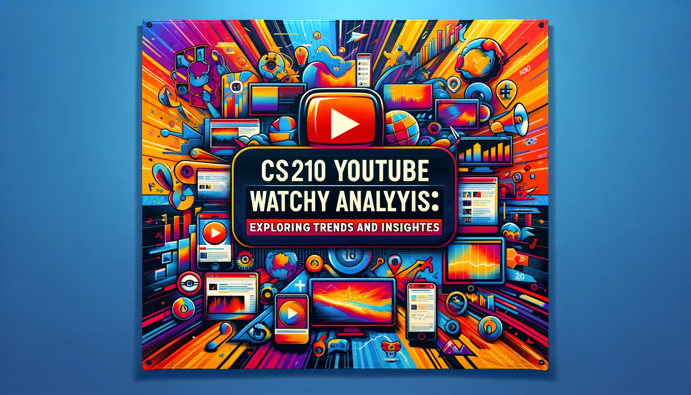

# YouTube Data Analysis Project - İsmail Çakmak

  

###For Presentation, Check My Website : [A Youtube Story](https://ismailcakmak.notion.site/A-Youtube-Story-0c08fbf0cc12490eb25765003b1d4c1c?pvs=4)

## Motivation

Welcome to my CS210 Data Science Project, where I delve deep into my personal YouTube usage data. As one of my most used platforms, YouTube has been a significant part of my life for many years. This project reflects not just my interaction with YouTube but also how it intersects with various aspects of my daily routine, including academics and leisure.

The primary goal of this project was to analyze my YouTube usage and derive insights into my viewing habits. I approached this by first extracting my YouTube data, then transforming it for analysis, and finally conducting a thorough examination of my viewing patterns.

## Data Source

Interestingly, the journey began with the discovery that Google shares our data with us. I downloaded my YouTube data from [google takeout](https://takeout.google.com/settings/takeout) in HTML format, then convert it to csv file.

## Project Overview

#### Data Transformation

Upon receiving the data in HTML format, I used BeautifulSoup for web scraping, converting the data into a more manageable CSV format. This step was crucial to prepare the data for analysis.

#### Data Analysis

With the data in a usable format, I proceeded to analyze my YouTube interactions. The analysis was conducted on two primary fronts:
1. **Video and Channel Preferences**: Identifying the most watched videos and frequently visited channels.
2. **Usage Patterns**: Understanding how often I accessed YouTube and discerning patterns in my viewing habits across different times of the year.

1. I used Matplotlib and Seaborn libraries to create a horizontal bar chart displaying the top 20 most-watched channels, top 20 most-watched video from a DataFrame.
2. I computed the average number of days between YouTube visits for each year by accumulating the total number of days elapsed between each viewing session and then dividing this total by the count of days when YouTube was accessed, yielding a yearly average re-entry period.
3. I created a pie chart to illustrate the distribution of videos watched across different years, as recorded in the DataFrame.
4. I filtered the data in my DataFrame to include only entries from 2023 and then extracted and categorized the month names from the 'Date of Watch' column. Using this data, I created a bar chart to visually represent the number of videos I watched each month in 2023/2022/2021, with customized axis labels, title, and angled month labels for clarity.

## Findings

1. **Most Watched Videos and Channels**: The analysis revealed a diverse range of content, from educational videos related to my courses to entertainment and lifestyle channels.

2. **Usage Frequency**: In 2023, I found that I accessed YouTube approximately once every six days. This frequency likely reflects my study habits, given that this account is secondary.

3. **Viewing Patterns Over Time**: Contrary to my initial hypothesis that I watched more videos during the summer, the data showed higher activity during the fall months, particularly around midterms.

## Visualizations

The project includes several visual representations of the data:

- Initial HTML Data Format
- Transformed CSV Format
- Most Watched Videos and Channels
- Pie Chart Of Yearly Watch Count
- Monthly Viewing Patterns for 2021, 2022, and 2023

[1](website images//distrubutionofyears.png)

## Limitations and future work

The project led to some intriguing insights, particularly the influence of my academic schedule on my YouTube usage. While I initially assumed that leisure time in summer would correlate with increased YouTube activity, the data suggested a different story - my viewing peaked during the academic months, especially around midterms. In the future I am planning analysing each video by its sentiment and content value, categorise them as educational, entertainment, lifestlye. So that I can analyse.

---

